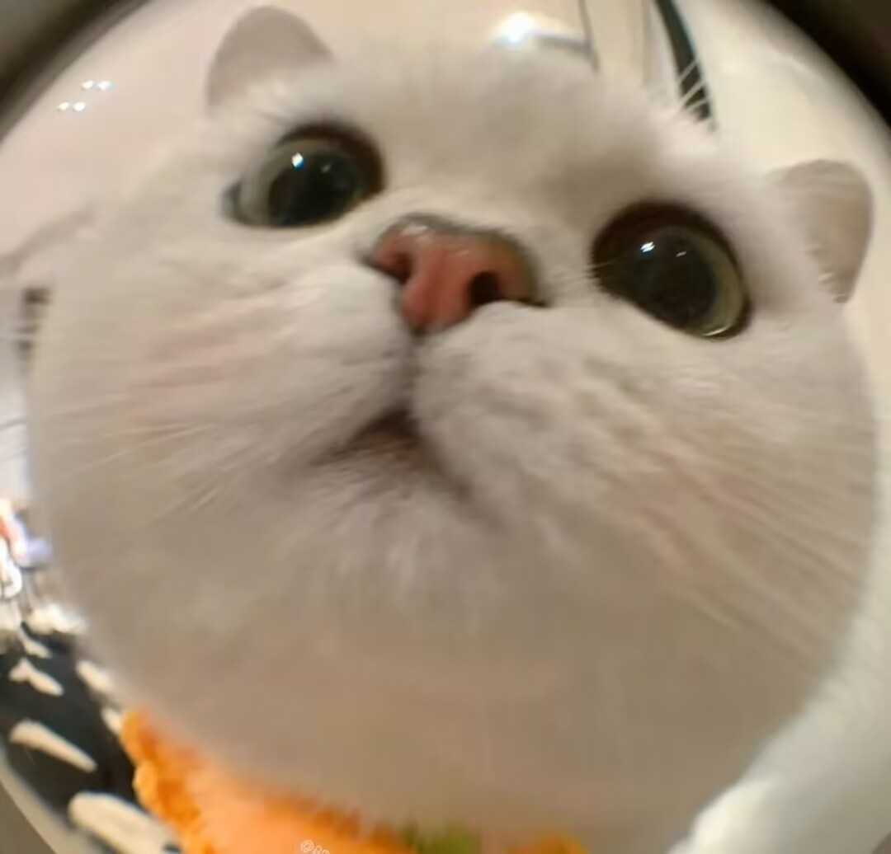

## YOLOV7：You Only Look Once目标检测模型在tf2当中的实现
### 目录
 1. [仓库更新 Top News](#top-news)
 2. [相关仓库 Related code](#相关仓库)


### Top News
`2022-09`:**仓库创建，支持不同尺寸模型训练，支持step、cos学习率下降法、支持adam、sgd优化器选择、支持学习率根据batch_size自适应调整、新增图片裁剪、支持多GPU训练、支持各个种类目标数量计算、支持heatmap。**
### 相关仓库

模型|路径
-|-
YoloV3|https://github.com/bubbliiiing/yolo3-tf2
YoloV4|https://github.com/bubbliiiing/yolo3-tf2

### YoloV4
训练数据集	|权值文件名称	|测试数据集|	输入图片大小|
-|-|-|-
mAP 0.5:0.95|	mAP 0.5|COCO-Train2017|	[yolov7_weights.pth](yolov7_x_weights.pth)|	COCO-Val2017|	640x640	51.0	|69.6
COCO-Train2017|	[yolov7_x_weights.pth](yolov7_x_weights.pth)	|COCO-Val2017	|640x640	52.7	71.0


### 文件下载
训练所需的权值可在百度网盘中下载。
链接: https://pan.baidu.com/s/1xmk6MDH-9Ug8GG3CYCFLrg
提取码: pg4c

VOC数据集下载地址如下，里面已经包括了训练集、测试集、验证集（与测试集一样），无需再次划分：
链接: https://pan.baidu.com/s/19Mw2u_df_nBzsC2lg20fQA
提取码: j5ge


### 训练步骤
#### a、训练VOC07+12数据集
1. 数据集的准备
**本文使用VOC格式进行训练，训练前需要下载好VOC07+12的数据集，解压后放在根目录**


2. 数据集的处理
修改voc_annotation.py里面的annotation_mode=2，运行voc_annotation.py生成根目录下的2007_train.txt和2007_val.txt。

3. 开始网络训练
train.py的默认参数用于训练VOC数据集，直接运行train.py即可开始训练。

4. 训练结果预测
训练结果预测需要用到两个文件，分别是yolo.py和predict.py。我们首先需要去yolo.py里面修改model_path以及  
**classes_path，这两个参数必须要修改。
model_path指向训练好的权值文件，在logs文件夹里。**
classes_path指向检测类别所对应的txt。
完成修改后就可以运行predict.py进行检测了。运行后输入图片路径即可检测。
```c
printf("hello word!")
```
 